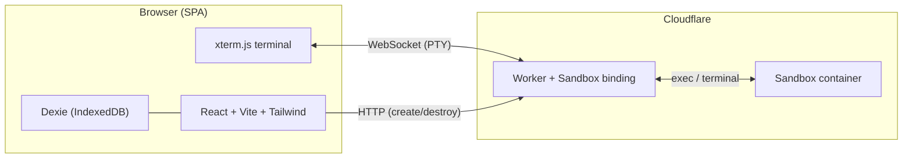

GitFS -- Ask Any GitHub Repo from Your Browser

Architecture

Core flow: User enters a repo URL, the SPA asks the Worker to spin up a Sandbox, the Worker clones the repo and starts an agent, and the user interacts with the agent through an xterm.js terminal -- all credentials live only in the browser.

Technical Decisions

1. Sandbox Provider: Cloudflare Sandbox SDK (not Modal)

Native PTY terminal support via sandbox.terminal(request) with built-in xterm.js addon (@cloudflare/sandbox/xterm) for auto-reconnection and buffered output replay

Scales to zero, pay-per-use ($0.000020/vCPU-sec active only), included free tier (25 GiB-hrs memory, 375 vCPU-min)

Edge deployment (330+ cities) means low latency to users globally

idle_timeout auto-kills inactive sandboxes to control costs

GA as of April 2026 with PTY, session isolation, and credential injection

2. Agent: OpenCode (primary), with Pi as alternative

OpenCode (recommended default):

opencode serve exposes headless HTTP API + SSE events -- we can drive it programmatically from the Worker or let users interact directly via terminal

opencode web provides a built-in web UI we could optionally proxy

JS/TS SDK (@opencode-ai/sdk) for programmatic session creation

opencode run --attach enables non-interactive one-shot prompts attached to a running server

Widest provider support, 142K stars, actively maintained

Install: npm install -g opencode-ai

Pi (lightweight alternative, user-selectable):

10MB footprint, 4 core tools (read, write, edit, bash)

Print mode (pi -p "query") for scripted use, RPC/JSON modes for integration

Install: npm install -g @mariozechner/pi-coding-agent

Both agents run in the sandbox's PTY. The user picks which agent in the settings UI. The sandbox image pre-installs both.

3. Repo Fetching: Tarball download (minimize GitHub API calls)

A single curl -L to GitHub's tarball endpoint (/repos/{owner}/{repo}/tarball/{ref}) downloads the entire default branch in one API request. No git protocol overhead, no rate-limited tree/blob calls.

Strategy:

Default (no token): curl -L https://github.com/{owner}/{repo}/archive/refs/heads/main.tar.gz | tar xz -- uses github.com download (not API, no rate limit counted)

With token (private repos): curl -L -H "Authorization: token $TOKEN" https://api.github.com/repos/{owner}/{repo}/tarball/main | tar xz -- costs 1 API call

Fallback for large repos or when git history needed: git clone --depth 1 --filter=blob:none --single-branch -- costs 1 API call equivalent

The extracted tarball is placed at /workspace/{repo-name}/ inside the sandbox.

4. Browser Storage: Dexie v4 (IndexedDB)

const db = new Dexie('gitfs');
db.version(1).stores({
  sessions:     '++id, repoUrl, agent, createdAt, lastActiveAt',
  messages:     '++id, sessionId, role, content, timestamp',
  settings:     'key',
  credentials:  'key',
  usage:        '++id, sessionId, provider, model, inputTokens, outputTokens, timestamp'
});

Tables:

sessions -- repo URL, agent choice, sandbox ID, timestamps

messages -- chat log per session (for history display, not sent to backend)

settings -- model choice, theme, preferred agent, default branch

credentials -- GitHub token, provider API keys (stored as-is; the browser is the trust boundary)

usage -- per-session token counts and cost estimates

5. Frontend: React + Vite + Tailwind CSS (Cloudflare Pages)

SPA with no SSR needed (zero backend philosophy)

Deployed to Cloudflare Pages (pairs with the Worker)

Three main views: Landing/Repo Input, Terminal Session, Settings

xterm.js with @cloudflare/sandbox/xterm SandboxAddon for terminal

@xterm/addon-fit for responsive sizing

React Router for navigation

useLiveQuery from Dexie for reactive settings/history reads

6. Credential Flow

sequenceDiagram
    participant B as Browser
    participant W as Worker
    participant S as Sandbox
    B->>B: User enters API keys in Settings UI
    B->>B: Keys stored in Dexie (IndexedDB)
    B->>W: POST /sandbox/create { repoUrl, agent, env: {API_KEYS} }
    W->>S: Sandbox.create(image, { env: {ANTHROPIC_API_KEY, ...} })
    Note over S: Keys exist only in sandbox env vars
    S->>S: Agent reads keys from env at startup
    Note over W: Worker never persists keys

Keys travel browser -> Worker -> Sandbox env vars

Worker is stateless, does not log or store keys

Sandbox is ephemeral, destroyed after idle timeout

Key Files and Structure

gitfs/
  packages/
    web/                          # React SPA (Cloudflare Pages)
      src/
        components/
          RepoInput.tsx           # URL input + branch selector
          TerminalView.tsx        # xterm.js + SandboxAddon
          SessionSidebar.tsx      # Past sessions list
          SettingsPanel.tsx       # API keys, model, agent choice
          UsageBadge.tsx          # Token/cost counter
        db/
          index.ts                # Dexie schema + db instance
          sessions.ts             # Session CRUD helpers
          credentials.ts          # Key get/set helpers
          usage.ts                # Usage tracking helpers
        hooks/
          useSandbox.ts           # Create/destroy sandbox, manage state
          useTerminal.ts          # xterm.js lifecycle + SandboxAddon
          useSettings.ts          # Reactive settings via useLiveQuery
        lib/
          parseRepoUrl.ts         # Extract owner/repo/branch from URL
          estimateCost.ts         # Token-based cost estimation
        App.tsx
        main.tsx
      index.html
      vite.config.ts
      tailwind.config.ts
    worker/                       # Cloudflare Worker
      src/
        index.ts                  # Router: /sandbox/create, /sandbox/destroy, /ws/terminal
        sandbox.ts                # Sandbox lifecycle (create, clone repo, start agent)
        auth.ts                   # Optional: validate session tokens
      wrangler.jsonc              # Sandbox binding, env vars
  package.json                    # Monorepo root (npm workspaces)
  README.md

Worker API Surface

Method

Path

Purpose

POST

/sandbox/create

Create sandbox, clone repo, start agent. Body: { repoUrl, branch, agent, env }. Returns { sandboxId }

POST

/sandbox/destroy

Terminate sandbox. Body: { sandboxId }

GET

/ws/terminal?id={sandboxId}&session={sessionId}

WebSocket upgrade -> PTY proxy

GET

/health

Liveness check

Sandbox Container Image

FROM node:22-slim
RUN apt-get update && apt-get install -y git curl && rm -rf /var/lib/apt/lists/*
RUN npm install -g opencode-ai @mariozechner/pi-coding-agent
WORKDIR /workspace

This image is referenced in wrangler.jsonc as the sandbox image. Both agents are pre-installed so the user can switch without rebuilding.

Test Cases

Unit Tests

parseRepoUrl("https://github.com/owner/repo") returns { owner: "owner", repo: "repo", branch: "main" }

parseRepoUrl("https://github.com/owner/repo/tree/dev") returns { owner: "owner", repo: "repo", branch: "dev" }

parseRepoUrl("owner/repo") (shorthand) returns { owner: "owner", repo: "repo", branch: "main" }

parseRepoUrl("not-a-url") throws InvalidRepoUrlError

Dexie credentials.set("ANTHROPIC_API_KEY", "sk-...") persists and credentials.get("ANTHROPIC_API_KEY") retrieves it

Dexie sessions.create({ repoUrl, agent }) creates a session and sessions.list() returns it sorted by lastActiveAt

estimateCost({ provider: "anthropic", model: "claude-sonnet-4", inputTokens: 1000, outputTokens: 500 }) returns correct dollar amount

Integration Tests (Worker)

POST /sandbox/create with valid repo URL returns { sandboxId } with status 200

POST /sandbox/create with invalid repo URL returns 400

POST /sandbox/create without any API keys in env returns 400 (no provider configured)

POST /sandbox/destroy with valid sandboxId returns 200

POST /sandbox/destroy with unknown sandboxId returns 404

GET /ws/terminal?id={validId} upgrades to WebSocket successfully

GET /ws/terminal?id={invalidId} returns 404

E2E Tests (Playwright)

User enters https://github.com/expressjs/express and clicks "Start" -> terminal appears with agent prompt

User types a question in the terminal -> agent responds (smoke test)

User opens Settings, enters an API key, refreshes the page -> key persists

User starts a session, navigates away, comes back -> session appears in sidebar history

User clicks a past session -> terminal reconnects (or shows "session expired" if sandbox was destroyed)

User switches agent from OpenCode to Pi in settings -> next session uses Pi

User enters a private repo URL without a GitHub token -> shows clear error message

User enters a private repo URL with a valid GitHub token -> repo clones successfully

Terminal resizes when browser window resizes (xterm fit addon)

Idle sandbox auto-terminates after configured timeout -> terminal shows disconnection message with option to restart

Security Tests

API keys are not present in network requests to any domain other than the Worker

API keys are not logged in Worker logs (verify via Cloudflare dashboard)

Sandbox cannot reach other sandboxes (network isolation)

Worker rejects requests without proper session context

No credentials appear in document.cookie or localStorage (only IndexedDB)

